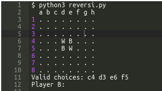
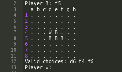
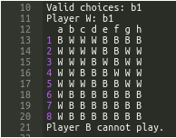

# GAME REVERSI - python3

Reversi is a strategy board game for two players, played on an 8×8 uncheckered board.

You can search more about the rules on the internet, even you can try a little at game online website.

[Play REVERSI Now](https://cardgames.io/reversi/).

### Enjoy the game

#### Clone my repository
```python3
git clone https://github.com/dinhnhu1401/REVERSI-GAME.git
cd REVERSI-GAME
python3 reversi.py
```

#### Run the game on the Online Python Compiler
Visit [my repl](https://repl.it/@dinhnhu1401/GAME-REVERSI) and enjoy

# Mission
Write a **light** version game of Reversi.

#### The game starts like this:


### First move:
The black player starts and gives a position among the valid choices. As you can see, the valid choices are given in alphabetical order.



### When a player cannot play
When a player cannot play, the game informs them.




### End condition
The game ends when both players cannot play anymore.


### Error handling
If the player plays something invalid, here is how you will handle it.
Putting it together.

Now, you also need to handle the case when a player doesn't have any valid move, as well as when both players don't have any move available.

Finally, when the game ends, you need to count the points.

# Analysis: Data structures and Functions

### Programming is basically functions and data structures.

- Use **list** in **list** to store a board.
First, we need a function to display the board. It's going turn a matrix like this:
```
[['.', '.', '.', '.', '.', '.', '.', '.'],
['.', '.', '.', '.', '.', '.', '.', '.'],
['.', '.', '.', '.', '.', '.', '.', '.'],
['.', '.', '.', 'W', 'B', '.', '.', '.'],
['.', '.', '.', 'B', 'W', '.', '.', '.'],
['.', '.', '.', '.', '.', '.', '.', '.'],
['.', '.', '.', '.', '.', '.', '.', '.'],
['.', '.', '.', '.', '.', '.', '.', '.']]
```
Into this:
```
  a b c d e f g h
1 . . . . . . . .
2 . . . . . . . .
3 . . . . . . . .
4 . . . W B . . .
5 . . . B W . . .
6 . . . . . . . .
7 . . . . . . . .
8 . . . . . . . .
```
- Then, we need a function to give us valid choices (*), depending on the player.
```
  a b c d e f g h
1 . . . . . . . .
2 . . . . . . . .
3 . . . * . . . .
4 . . * W B . . .
5 . . . B W * . .
6 . . . . * . . .
7 . . . . . . . .
8 . . . . . . . .
Step: 0
Valid choices: e6 c4 d3 f5
Player B:
```

- Finally, validate the player's choice and then replace all enemies between by wildcard character for the current player.
  Automatically check the valid choices for next player.
```
Player B: e6
  a b c d e f g h
1 . . . . . . . .
2 . . . . . . . .
3 . . . . . . . .
4 . . . W B * . .
5 . . . B B . . .
6 . . . * B * . .
7 . . . . . . . .
8 . . . . . . . .
Step: 1
Valid choices: e6 c4 d3 f5
Player W:
```
 
# Solution and related skills:

## Solution:

While the list of valid choice exits:

- Define the current player and then identify the enemy
- Go through the board, for each cell:
	- If the current cell is player:
		- Check 8 directions with this cell is the central cell, for each direction:
			- If the enemy is adjacent to the central cell and don't be surrounded by our troops, add to the list of valid choices and also record the position of all the enemies inside.
- Optimize player's choice by maximizing the number of enemies captured and display the list of valid choices by this order.
- When the current player **chooses** the next step, retrieve all enemies depends on the player's choice.

## Ralated skills:

- Use **collections** import *defaultdict*
- Use **itertools**
  
# Coding Journey

|Period time      |Describe Stuck or A done feature      |Cause or Result       |
|-----------------|--------------------------------------|----------------------|
|24h of Hyperspace| A stupid mess!                       | Distracted, not calm |
|10h - .......    | Omit the old and rebuild the new one | Ver 0.1 - 2 bugs     |
|...........      | Write README Ver 0.1                 | The skeleton structure |
|5h - 21/12/2019  | Bug 1: Can not find all the valid choices | Check wrong conditions, omit the asterisk case |
|2h - 21/12/2019  | Bug 2: The loop of the game is broken| Forget to check the boundary - Ver 1.0.0 |
|2h - 22/12/2019  | Write README Ver 0.2.                | Solution + Coding Journey |
|3h - 23/12/2019  | Add comment and re-design code       | Ver 1.0.1 |
|1h - 23/12/2019  | Bug 3: The loop of the game is overflow| Assign input of user - Ver 1.1.0 |