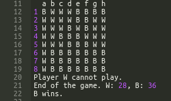

# Reversi - INTEK Project
Reversi is a strategy board game for two players, played on an 8×8 uncheckered board. There are sixty-four identical game pieces called disks (often spelled "discs"), which are light on one side and dark on the other. Players take turns placing disks on the board with their assigned color facing up. During a play, any disks of the opponent's color that are in a straight line and bounded by the disk just placed and another disk of the current player's color are turned over to the current player's color.  The object of the game is to have the majority of disks turned to display your color when the last playable empty square is filled.

# Mission
Today, for your first group project, you will write a game of Reversi.

If you don't know that game yet, start by looking it up on the internet. Play a game or two with your teammates to get a good sense of how the game works!

Right, so now you know what Reversi is. Let's move to coding it.

#### The game starts like this:


## First move:

The black player starts and gives a position among the valid choices. As you can see, the valid choices are given in alphabetical order.


## When a player cannot play
When a player cannot play, the game informs them.


## End condition
The game ends when both players cannot play anymore.



# Analysis: data structures
What are the different concepts of this game? What data structures and data types will you use for each concept?

First, you have the concept of player: there are two players, W and B. Let's keep it simple, you can use a string for that: 'W'and 'B'.

Then, there is the score. This is easy, we can choose an int to count the points. Whether you want to store the score for each player in a dict or in 2 variables, it's up to you. For example: points = {'W': 0, 'B': 0} or point_w, point_b = 0, 0. Both work.

Now there is the board. How can we store that? We could use a string, but strings are immutable, so doing something like board[0] = 'W' would be impossible. For the same reason, we won't use a tuple. Now, we could use a dict or a list. The problem with the dict is that iterating on a dict is not as straightforward as iterating on a list. How can you be sure that you're iterating in the right order? (Depending on your version of python3, you can have different behaviors). So, for the board, the list is the winner.

I'd go even further, and say that a list of list (matrix) can be used. For a board like this:

```
B B
W W
```
I would store it like this:

```
[['B', 'B'],
['W', 'W']]
```

# Analysis: functions
Programming is basically functions and data structures. So now that we have our data structures, let's think about our functions.

First, we need a function to display the board. It's going turn a matrix like this:

```
[['.', '.', '.', '.', '.', '.', '.', '.'],
['.', '.', '.', '.', '.', '.', '.', '.'],
['.', '.', '.', '.', '.', '.', '.', '.'],
['.', '.', '.', 'W', 'B', '.', '.', '.'],
['.', '.', '.', 'B', 'W', '.', '.', '.'],
['.', '.', '.', '.', '.', '.', '.', '.'],
['.', '.', '.', '.', '.', '.', '.', '.'],
['.', '.', '.', '.', '.', '.', '.', '.']]
```

Into this:

```
  a b c d e f g h
1 . . . . . . . .
2 . . . . . . . .
3 . . . . . . . .
4 . . . W B . . .
5 . . . B W . . .
6 . . . . . . . .
7 . . . . . . . .
8 . . . . . . . .
```

Then, we need a function to give us the valid choices, depending on the player.

There are 4 axes you need to look at: 2 diagonals, 1 vertical and 1 horizontal. For each of these axes, you need to look at both directions. For example, on the horizontal axis, you need to look to the left and to the right.

Let's take d5 as an example. On the horizontal axis:

- To the left, there is an empty space, so we don't have any move there.

- To the right, there is a W piece, so we can play in f5. On the vertical axis:

- To the top, there is a W piece, so we can play in d3.

- To the bottom, there is an empty space, so we don't have any move there. On the top left/bottom right diagonal axis, there are only empty spaces, so no possible moves. On the other diagonal axis, there is an empty space and a B piece, so no moves either.
  

What could your algorithm be? Let's take an arbitrary piece and an adjacent cell, and let's iterate over the possibilities.

We start from our piece, here it's d5. The current player is B.

- If the next cell is an empty space '.', then no move.
- If the next cell is a 'B', then no move either.
- If the next cell is a 'W', find the first cell that is not a 'W'. If that cell is a 'B', then, there are no solutions. If it's a '.', then it's a valid move!

Ok, you should have enough information to do that function now. After that, you will need a function to actually play the move that the player inputs.

# Error handling
If the player plays something invalid, here is how you will handle it.

Putting it together
Now, you also need to handle the case when a player doesn't have any valid move, as well as when both players don't have any move available.

Finally, when the game ends, you need to count the points.

Good luck!